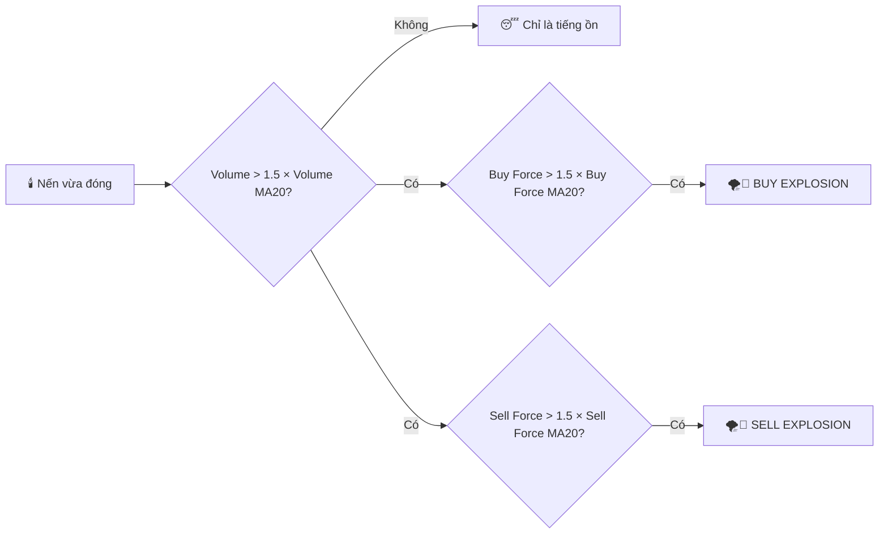
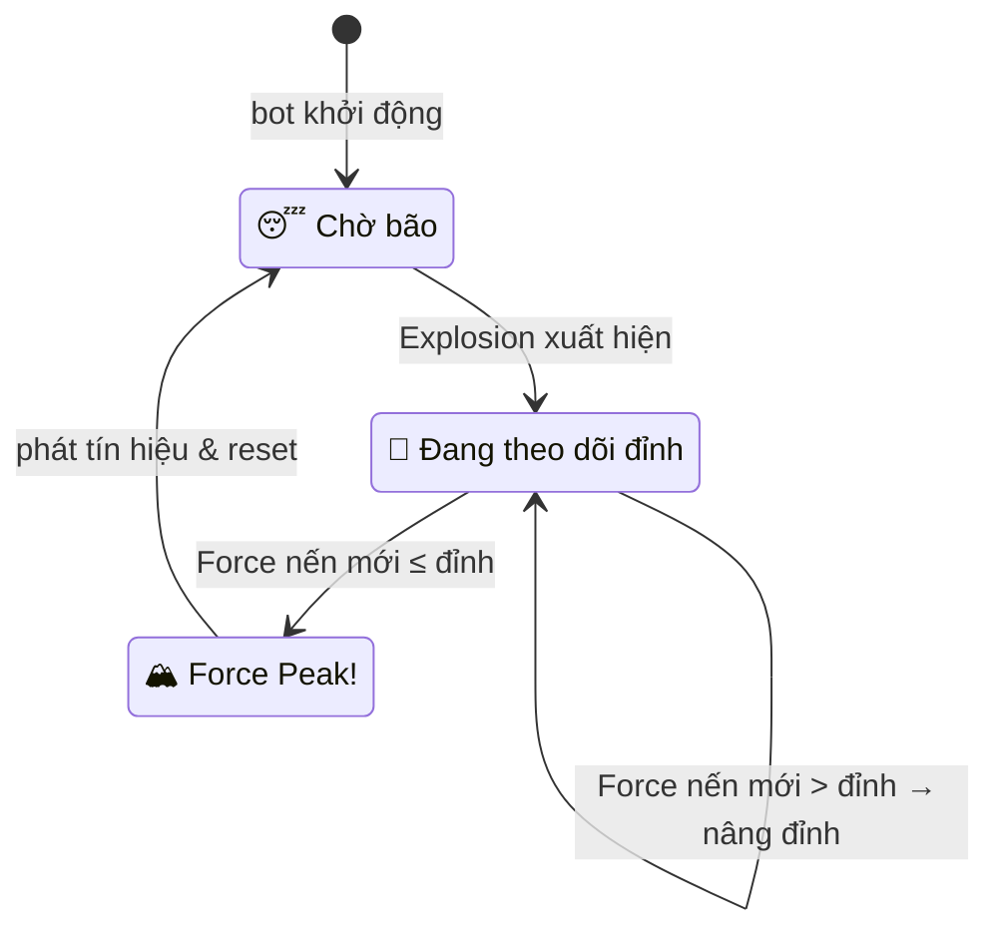
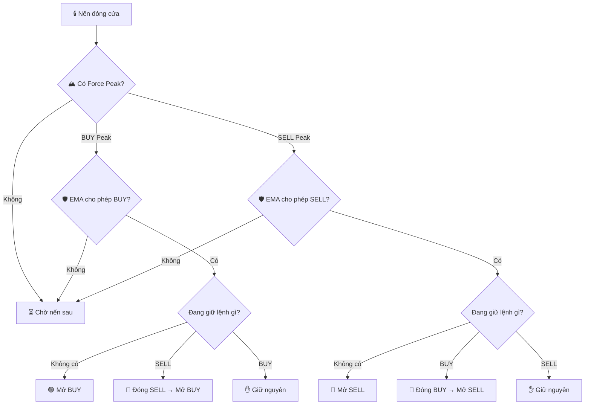
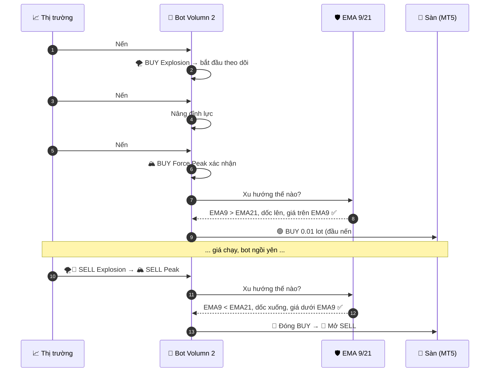

<div align="center">

# 🥇 Bot-EA-Trading-XAUUSD-Volumn

### Bot Volumn 2 — *Force Peak + EMA 9/21*

**© 2026 Hồ Ngọc Khánh ([@LiinIT](https://github.com/LiinIT)) — All rights reserved.**
*Tác giả & chủ sở hữu bản quyền mã nguồn trong repository này.*

**scalping volumn of Khanh**<br>
**Donate coffee:** <br>1907.5049.8560.17 (Techcombank)** <br> **68814062001 (Techcombank) !!! Thanks**

☕ Nếu bot giúp bạn hiểu thị trường thêm một chút, mời Khánh một ly cà phê nhé ☕


</div>

---

## 📂 Có gì trong repo

| File | Nền tảng | Dùng để |
|---|---|---|
| [`mt5/BotVolumn2_ForcePeak_EMA.mq5`](mt5/BotVolumn2_ForcePeak_EMA.mq5) | MetaTrader 5 | EA tự động vào / đảo lệnh |
| [`tradingview/BotVolumn2_ForcePeak_EMA.pine`](tradingview/BotVolumn2_ForcePeak_EMA.pine) | TradingView | Strategy để xem tín hiệu & backtest bằng Strategy Tester |

Hai file dùng **cùng một logic**: tín hiệu tính trên **nến đã đóng**, lệnh khớp ở **giá mở nến kế tiếp**.

---

## 🎬 Trailer

> *Thành phố Vàng — XAUUSD. Mỗi phút, hàng nghìn giao dịch va vào nhau.*
> *Phần lớn chỉ là tiếng ồn. Nhưng thỉnh thoảng… có một **cơn bão volume** ập tới.*
> *Bot Volumn 2 không đuổi theo cơn bão. Nó **chờ cơn bão đạt đỉnh**, nhìn sang **hai vệ sĩ EMA**, rồi mới bóp cò.*

---

## 🎭 Dàn nhân vật

| Nhân vật | Vai trò trong code | Tính cách |
|---|---|---|
| 🐂 **Bò Mua** — *Buy Force* | `volume × (close − low) / (high − low)` | Càng đẩy giá đóng cửa sát đỉnh nến, càng mạnh |
| 🐻 **Gấu Bán** — *Sell Force* | `volume × (high − close) / (high − low)` | Càng dìm giá đóng cửa sát đáy nến, càng mạnh |
| 🌪️ **Cơn Bão** — *Explosion* | Volume > 1.5 × Volume MA **và** Force > 1.5 × Force MA | Chỉ xuất hiện khi thị trường thật sự "nổ" |
| 🏔️ **Đỉnh Lực** — *Force Peak* | Nến đầu tiên mà lực **không vượt** được đỉnh cũ | Khoảnh khắc cơn bão bắt đầu hụt hơi |
| 🛡️ **Vệ sĩ EMA 9** | EMA nhanh | Nhạy, đi sát giá |
| 🛡️ **Vệ sĩ EMA 21** | EMA chậm | Điềm tĩnh, xác nhận xu hướng |
| 🤖 **Bot Volumn 2** | `ProcessClosedBar()` | Kiên nhẫn, chỉ hành động khi đủ cả 3 điều kiện |

---

## 📺 Tập 1 — Cơn bão ập đến *(Volume & Force Explosion)*

Mỗi khi một cây nến **đóng cửa**, bot đo sức của Bò và Gấu:

```text
            high ─┬─            Buy Force  = volume × (close − low)  / range
                  │  ▲ Gấu       Sell Force = volume × (high − close) / range
           close ─┤  │ đẩy xuống
                  │  │
                  │  ▼ Bò
             low ─┴─ đẩy lên
```

Cơn bão chỉ được công nhận khi **cả hai** điều kiện cùng đúng:



---

## 📺 Tập 2 — Leo lên đỉnh lực *(Force Peak)*

Bot **không vào lệnh ngay lúc bão nổ**: lúc đó giá thường đã chạy xa, vào là đu đỉnh. Nó theo dõi xem cơn bão còn mạnh lên hay không:

```text
 Force
   ▲
   │              ██  ← ĐỈNH LỰC (peak)
   │         ██   ██
   │         ██   ██   ▓▓  ← nến đầu tiên KHÔNG vượt đỉnh
   │    ██   ██   ██   ▓▓        ⇒ 🏔️ FORCE PEAK XÁC NHẬN
   │ ── ██ ──██── ██── ▓▓ ──────── 1.5 × Force MA
   │    ██   ██   ██   ▓▓   ░░
   └────┴────┴────┴────┴────┴────▶ nến
       🌪️   tăng  tăng  hụt
      (bắt  tiếp  tiếp  hơi
      đầu)
```



> 🔎 Trên chart TradingView, Đỉnh Lực hiện thành chấm **BP** (Buy Peak) dưới nến và **SP** (Sell Peak) trên nến.

---

## 📺 Tập 3 — Hai vệ sĩ gác cổng *(EMA 9/21)*

Đỉnh Lực mới chỉ là "tin đồn". Hai vệ sĩ EMA phải cùng gật đầu thì bot mới hành động:

| Điều kiện | 🐂 Cho phép BUY | 🐻 Cho phép SELL |
|---|---|---|
| Vị trí | EMA 9 **>** EMA 21 | EMA 9 **<** EMA 21 |
| Độ dốc | EMA 9 đang **dốc lên** | EMA 9 đang **dốc xuống** |
| Giá | Close **trên** EMA 9 | Close **dưới** EMA 9 |

```text
 Giá
   ▲          ╭──╮  close > EMA9  ✅
   │       ╭──╯  ╰─╮
   │  ━━━━━━━━━━━━━━━━━━━  EMA 9  (dốc lên ✅)
   │  ─────────────────────  EMA 21 (nằm dưới ✅)
   └──────────────────────────▶
          ⇒ 🛡️🛡️ "Vệ sĩ cho qua — được phép BUY"
```

---

## 📺 Tập 4 — Bóp cò *(Vào lệnh & đảo chiều)*



Bot **luôn giữ tối đa 1 lệnh** và chỉ thoát lệnh theo một trong hai cách:
1. Có tín hiệu **ngược chiều đầy đủ** (Đỉnh Lực + EMA xác nhận). Một Đỉnh Lực ngược chiều **chưa đủ** để đóng lệnh.
2. Chạm **SL/TP** nếu bạn bật trong phần *Risk Management*.

---

## 📺 Tập 5 — Một ngày làm việc của bot *(Timeline)*



---

## 🛠️ Cài đặt

### MetaTrader 5
1. MT5 → **File → Open Data Folder → `MQL5/Experts`**.
2. Copy file `mt5/BotVolumn2_ForcePeak_EMA.mq5` vào thư mục đó.
3. Mở **MetaEditor** (F4) → mở file → **Compile** (F7).
4. Kéo EA vào chart **XAUUSD** (khuyên dùng M5 – M15) → bật **Algo Trading**.
5. Chạy **Strategy Tester** (Ctrl+R), chế độ *Every tick based on real ticks*, và test trên **tài khoản demo** trước.

### TradingView
1. Mở chart **XAUUSD** của một feed có volume (OANDA, FXCM, Pepperstone…).
2. **Pine Editor** → dán nội dung `tradingview/BotVolumn2_ForcePeak_EMA.pine` → **Add to chart**.
3. Xem kết quả ở tab **Strategy Tester**. Muốn nhận thông báo thì tạo Alert với *BotVolumn2 BUY / SELL*.

---

## ⚙️ Tham số

| Nhóm | Tham số | Mặc định | Ý nghĩa |
|---|---|---|---|
| Trading | Lot Size | `0.01` | Khối lượng mỗi lệnh (TradingView: qty = Lot × Contract Size) |
| Trading | Magic Number *(MT5)* | `9212026` | Phân biệt lệnh của bot với lệnh tay |
| Trading | Allow Buy / Sell | `true` | Tắt một chiều: bot vẫn **đóng** lệnh ngược nhưng không mở chiều bị tắt |
| Force | Force / Volume MA Length | `20` | Chu kỳ trung bình để so sánh |
| Force | Volume / Force Explosion x | `1.5` | Hệ số "nổ" |
| EMA | Fast / Slow | `9 / 21` | Hai vệ sĩ |
| EMA | Slope Bars | `1` | Số nến dùng để đo độ dốc EMA nhanh |
| Risk | Use SL / TP, Points | `false / 0` | XAUUSD 2 chữ số: **100 points = $1 giá** |
| Filter *(MT5)* | Max Spread | `0` (tắt) | Chặn vào lệnh khi spread quá rộng |

---

## 🧬 MT5 vs TradingView — giống và khác

| | MT5 | TradingView |
|---|---|---|
| Thời điểm tính | Nến đóng (shift 1) | Nến đóng |
| Giá khớp | Ask/Bid thật đầu nến kế tiếp | Open nến kế tiếp |
| Volume | Tick volume của broker | Volume của feed TradingView |
| Spread / trượt giá | Có thật | Không có (cần tự cấu hình commission/slippage trong Properties) |
| Lọc spread | Có | Không |

➡️ Vì **volume giữa các feed khác nhau**, tín hiệu hai nền tảng có thể lệch nhau vài lệnh. Đây là điều bình thường.

---

## 🩹 Nhật ký sửa lỗi so với bản `bot-volumn-2` gốc

| # | Lỗi ở bản gốc | Hậu quả | Đã sửa |
|---|---|---|---|
| 1 | `g_buyPeakShift` / `g_sellPeakShift` luôn bằng 1, trong khi điều kiện xác nhận cần `== 2` | **EA không bao giờ vào lệnh** | Theo dõi đỉnh theo trạng thái, xác nhận ở nến đầu tiên không vượt đỉnh |
| 2 | `buyForceMA`, `sellForceMA` dùng `SMA(..., false)`, tức **SMA của giá close** | So sánh lực với giá vàng (~×1.5 giá), gần như không bao giờ "nổ" | Tính SMA đúng trên Buy/Sell Force |
| 3 | Đỉnh chỉ được nâng khi có Explosion | Nếu nến sau mạnh hơn nhưng volume không nổ, tracking bị **kẹt vĩnh viễn** | Lực mạnh hơn luôn nâng đỉnh |
| 4 | `PositionSelect(_Symbol)` chỉ lấy lệnh đầu tiên của symbol | Tài khoản hedging có lệnh tay thì bot nhận nhầm là đang FLAT | Duyệt toàn bộ lệnh theo Magic Number |
| 5 | Nến có high = low thì Force = 0 | Lệch so với bản TradingView | Dùng `max(range, 1 point)` như Pine |
| 6 | `Sleep(100)` sau khi đóng lệnh, không kiểm tra retcode | Có thể mở lệnh mới khi lệnh cũ chưa đóng | Kiểm tra `TRADE_RETCODE_DONE` trước khi mở lệnh mới |

---

## ⚠️ Cảnh báo rủi ro

- Đây là **dự án cá nhân / học tập**, không phải lời khuyên đầu tư. Lợi nhuận trong quá khứ không đảm bảo cho tương lai.
- Mặc định **không có SL/TP**, lệnh chỉ đóng khi có tín hiệu ngược. Với vốn nhỏ, một nhịp chạy một chiều có thể gây lỗ lớn. **Hãy bật SL.**
- XAUUSD biến động rất mạnh lúc ra tin (NFP, CPI, FOMC). Nên tắt bot quanh các thời điểm này.
- Luôn **backtest + chạy demo** trước khi dùng tiền thật.

---

<div align="center">

## ☕ Ủng hộ tác giả

**scalping volumn of Khanh - Donate coffee: 1907.5049.8560.17 (Techcombank) / 68814062001 (Techcombank) !!! Thanks**

Mỗi ly cà phê là thêm một đêm Khánh ngồi soi chart và nâng cấp bot 🚀

*Hết phim. Hẹn gặp lại ở **Bot Volumn 3**… 🎬*

**© 2026 Hồ Ngọc Khánh (LiinIT). All rights reserved.**

</div>
